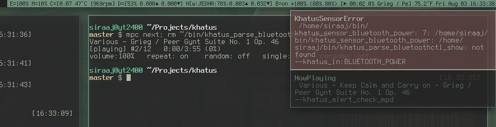

khatus
======


Experimental system-monitor and status (bar) reporter I use with
[dwm](https://dwm.suckless.org/) on GNU/Linux.


Usage
-----

In my `~/.xinitrc` I have something like the following:

```sh
( $BIN/khatus \
    --wifi_interface 'wlp3s0' \
| stdbuf -o L tee \
    >(stdbuf -o L "$BIN"/khatus_bar \
        -v Opt_Mpd_Song_Max_Chars=10 \
        -v Opt_Net_Interfaces_To_Show=wlp3s0 \
        -v Opt_Pulseaudio_Sink=0 \
    | "$BIN"/khatus_actuate_status_bar_to_xsetroot_name \
    ) \
    >(stdbuf -o L "$BIN"/khatus_monitor_energy \
    | "$BIN"/khatus_actuate_alert_to_notify_send \
    ) \
    >(stdbuf -o L "$BIN"/khatus_monitor_errors \
    | "$BIN"/khatus_actuate_alert_to_notify_send \
    ) \
) \
2> >($BIN/twrap.sh >> $HOME/var/log/khatus/main.log) \
1> /dev/null \
&
```
(where `twrap` is a simple script which prefixes a timestamp to each line)

The idea is to support appending any number of ad-hoc, experimental monitors by
giving maximum flexibility for what to do with the sensor outputs, while
maintaining some uniformity of msg formats (again, to ease ad-hoc combinations
(e.g. Does the CPU get hotter when MPD is playing Wu-Tang?)).  `khatus_bar`,
`khatus_monitor_energy` and `khatus_monitor_errors` are just some initial
examples.

Design
------

### 2.0

In an effort to simplify the components and their interfaces, I removed the
concept of a global controller from the previous design (which, at least for
now, is superfluous), so now it is essentially a pub-sub - parallel publishers
(sensors) write to a pipe, which is then copied to any number of interested
subscribers that can filter-out what they need and then do whatever they want
with the data. Status bar is one such subscriber:

`P1 > pipe&; P2 > pipe&; ... PN > pipe&; tail -f pipe | tee >(S1) >(S2) ... >(SN) > /dev/null`

The cool thing is that, because the pipe is always read (`tail -f ... > /dev/null`),
the publishers are never blocked, so we get a live stream of events to which we
can attach any number of interested subscribers (` ... tee ... `) and, because
the pipe is named, if a subscriber needs to - it too can publish something to
the pipe without being blocked.

```
parallel    +----------+  +----------+          +----------+
stateless   | sensor_1 |  | sensor_2 |    ...   | sensor_n |
collectors  +----------+  +----------+          +----------+
                 |             |           |         |
               data          data        data      data
                 |             |           |         |
                 V             V           V         V
multiplexing     +-------------+-----------+---------+
to a pipe                      |
                               |
                               V
copying to       +-------------+-+---------+---------+
subscribers      |               |         |         |
                 V               V         V         V
              +------------+         ...      +----------------+
any number of | status bar |                  | energy monitor |
parallel      +------------+                  +----------------+
subscribers      |                                    |
                 V                                    V
              +----------------+              +-------------+
              | xsetroot -name |              | notify-send |
              +----------------+              +-------------+
```

### 1.0

This was an improvement of having everything in one script, but the controller
was still way too complicated for no good reason.

```
parallel    +----------+  +----------+          +----------+
stateless   | sensor_1 |  | sensor_2 |    ...   | sensor_n |
collectors  +----------+  +----------+          +----------+
                 |             |           |         |
               data          data        data      data
                 |             |           |         |
                 V             V           V         V
serial      +----------------------------------------------+
stateful    |                controller                    |
observer    +----------------------------------------------+
                               |
                       decision messages
decision                       |
messages                       |
copied to                      |
any number                     |
of interested                  |
filter/actuator                |
combinations                   |
                               |
                               V
                 +-------------+-+---------+---------+
                 |               |         |         |
                 V               V         V         V
parallel    +------------+ +------------+     +------------+
stateless   | filter_1   | | filter_2   | ... | filter_n   |
filters     +------------+ +------------+     +------------+
                 |               |         |         |
                 V               V         V         V
parallel    +------------+ +------------+     +------------+
stateless   | actuator_1 | | actuator_2 | ... | actuator_n |
executors   +------------+ +------------+     +------------+
                 |              |          |         |
              commands       commands   commands  commands
                 |              |          |         |
                 V              V          V         V
            ~~~~~~~~~~~~~~~~~~~~~~~~~~~~~~~~~~~~~~~~~~~~~~~~
            ~~~~~~~~~~~~~ operating system ~~~~~~~~~~~~~~~~~
            ~~~~~~~~~~~~~~~~~~~~~~~~~~~~~~~~~~~~~~~~~~~~~~~~
```

### 0.x

A single script, re-executed in a loop at some intervals, serially grabbing all
the needed data and outputting a status bar string, then passed to `xsetroot -name`,
while saving state in files (e.g. previous totals, to be converted to deltas).

This actually worked surprisingly-OK, but had limitations:

- I use an SSD and want to minimize disk writes
- not flexible-enough to support my main goal - easy experimentation with
  various ad-hoc monitors:
    - I want to set different update intervals for different data sources
    - I don't want long-running data collectors to block the main loop

### Actuator
Actuator is anything that takes action upon controller messages. A few generic
ones are included:

- `khatus_actuate_alert_to_notify_send`
- `khatus_actuate_status_bar_to_xsetroot_name`

and, by default, are left disconnected from the data feed, so if desired - need
to be manually attached when starting `khatus`. See usage section.

### Errors
Any errors encountered by any sensor are propagated as alerts by the
controller, which are in turn actualized as desktop notifications by the
`khatus_actuate_alert_to_notify_send` actuator:



TODO
----

- status bar templating language
- retry/cache for sensors fetching flaky remote resources (such as weather)
- throttling of broken sensors (constantly returns errors)
- alert specification language
    - trigger threshold
    - above/bellow/equal to threshold value
    - priority
    - snooze time (if already alerted, when to re-alert?)
    - text: subject/body

Redesign notes
--------------

- controller should not do formatting
- need in-memory db for diskless feedback/throttling and cache
- decouple sensor execution from sleep, i.e. a sensor is blocked not by sleep
  process directly, but by reading of a pipe, to where a sleep process will
  write a message announcing interval completion and thus signaling execution.
  This will allow us to manually signal a sensor to update (concretely - I just
  openned my laptop from sleep and want to force the weather to update
  immediately); likewise, the sleep process should be blocked on pipe-read
  until sensor execution is complete - this will allow us to reconfigure
  intervals at runtime (which seems like a better idea than the above in-memory
  DB one).
