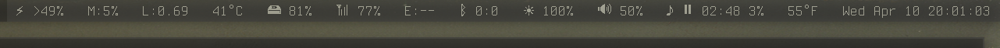

khatus
======

Experimental system-monitor and status (bar) reporter I use with
[dwm](https://dwm.suckless.org/) on GNU/Linux.

Experiments
-----------
The approaches experimented-with so far (later versions do not _necessarily_
obsolete earlier ones, they're just different):

| Name   | Status    | Language  | Tested-on    | Description |
|--------|-----------|-----------|--------------|-------------|
| __x1__ | Archived  | Bash, AWK | Ubuntu 16.04 | Single, synchronous script, saving state in text files |
| __x2__ | In-use    | Bash, AWK | Debian 10    | Parallel processes: collectors, cache and reporters; passing messages over pipes |
| __x3__ | Scratched | OCaml     | Debian 10    | Re-write and refinement of __x2__ |
| __x4__ | In-dev    | Dash, AWK | Debian 10    | Sensors are completely decoupled daemons, cache is a file tree |
